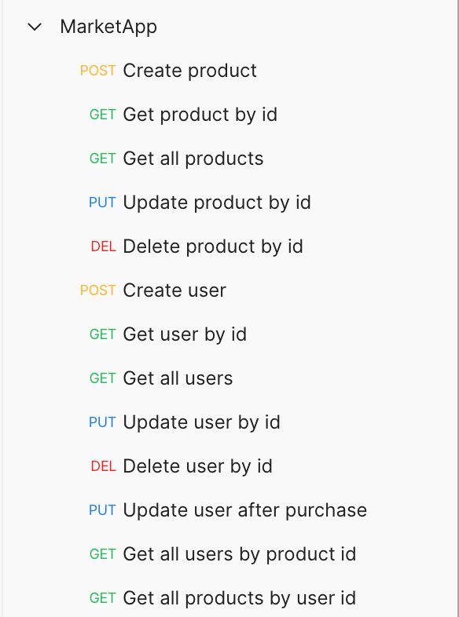

# Market-app

This application is implemented as a market service.
- --

### If you want to run this project on your computer, you need:
1. Clone this project:
2. Install Lombok plugin (or replace all @Data annotations with getters, setters and toString)
3. Install MySQL 
4. Run 'MarketAppApplication' class
5. Use Postman for sending your requests during testing this application
6. Injection of products and users are located in config/DataInitializer class.
- --

### The structure of this project consists of 3 levels:
* Controller Layer.
* Service layer.
* Repository layer.
- --

### Available endpoints in the project:
- `http://localhost:8080/products/` -  CRUD OPERATIONS
- `http://localhost:8080/users/` - CRUD OPERATIONS
  
- --

### Used technologies
- Java 11
- SpringBoot
- MySql Database
- Lombok
- Swagger
- Maven checkstyle plugin
